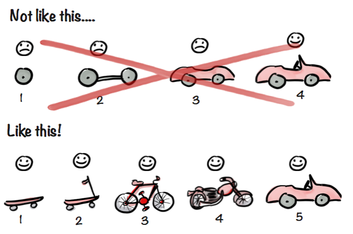
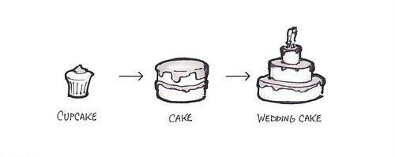

---
# Page settings
layout: default
keywords:
comments: false

# Hero section
title: MVP -> MLP
description: A simple, yet lovable and complete product

# Author box
<!-- author:
    title: About Sebastian
    title_url: 'https://krumhausen.com'
    external_url: true
    description: Product Manager & Digital Strategist -->

# Micro navigation
micro_nav: true

# Page navigation
page_nav:
    prev:
        content: Previous page
        url: '#'
    next:
        content: Next page
        url: '#'

---

## When to run: Minimum Viable Product?

## Why MVP?

Minimum Viable Products, MVPs are great for startups and product teams because they maximize validated learning about customers as quickly as possible.

Many projects fail badly because they do Big Bang delivery (build the thing until 100% done and deliver at the end). Agile is presented as a solution, but customers cannot use a half build car. Customers don't care if you build something using waterfall or agile.

[The Lean Startup](http://theleanstartup.com) introduces the idea of the Minimum Viable Product where the product team builds the quckest, smallest thing possible to get customer feedback and learn.

## What people get wrong about the MVP

Technically it might be incremental and iterative delivery, but the absence of an actual feedback loop makes it very risky – and definitely not agile. Instead, focus on the underlying need - what the customer wants fulfilled

Instead of starting with an uninteresting dry cake and then adding filling and icing, you start with a delicious cupcake and iterate it into a cake. Customers will pay for a cupcake because it’s complete with filling and icing.

## MVP -> Earliest Lovable Product

Minimum Viable Product. The underlying idea is great, but the term itself causes a lot of confusion and angst. “*Minimum*” and “*Viable*” mean different things to different people, and that causes problems. 

Building a feature-complete product requires too much time and money, but rushing a feature-poor product out the door would push away potential customers and yield no useful learnings.

To find the right level of functionality *use this thinking:*

**Minimum => Earliest**: Replace minimum with earliest. The whole idea behind releasing an MVP is to get early feedback. Few customers want “minimum” but most customers want “early”!

**Viable => Lovable**: Viable is too vague. Some people think Viable means “something I can test and get feedback from”, others think it means “something the customer can actually use”. So let’s be more explicit and split it into three different things:

 

### 1. Earliest testable product

It might not make customers happy and solve their problems, but it will generate feedback you can learn from.

Great testable products are landing pages, prototypes and fake doors used to test user demand. The goal of an MVP is to prove that people will use your product. Landing pages and paid ads are a great low-cost way to gauge interest because you test the basic value proposition

### 2. Earliest usable product

The first release that early adopters will actually use, willingly.

### 3. Earliest lovable product

The first release that customers will love, tell their friends about, and be willing to pay for.

**Pro tip**: First impressions matter a lot. Take a cautious approach and limit the release to a small user base and iterate until it becomes the lovable product that is ready for all users.

## Defining your Early _______ Product

After filling out one of a few [Experimentation Briefs](/plays/run-experiments#experimentation-brief) you have a set of experiments and the success criteria for each. Use your own judgment whether to bundle the experiments into an MLP or whether the experiments are so light and fast, that there is no need to build anything yet. e.g., *make a few phone calls*. 

- **What is in MLP?**: Write down the features of the MLP, and then decide what is required for the minimum lovable product.

- **What is not in MLP?**: Feature creep happens very easily, so it's good idea to write down all the features that were intentional left out (and why). This is even more important than selecting what in the MLP

  

### MLP Description & backlog

- Once you have your features for the MLP you can list the things needed to complete it. How will you test the business model and validate the user need without building too much?
- Which [**Job-to-be-done**](/plays/jobs-to-be-done) is the MLP solving (the value proposition)?
- The [**Business objective**](/plays/okr) and how to meassure success (OKRs)
- **Backlog**: List of tasks

## Examples of MLPs
[Paul Bucheit](http://paulbuchheit.blogspot.com/2010/02/if-your-product-is-great-it-doesnt-need.html)’s advice remains invaluable to anyone building a product today: 

> Pick three key attributes or features, get those very, very right and forget about everything else.

**iPod**
The original iPod was: 1) small enough to fit in your pocket, 2) had enough storage to hold many hours of music and 3) easy to sync with your Mac

**Gmail**
By focusing on 1) search, 2) an easy-to-use interface, and 3) a whopping gigabyte of free email storage, Gmail blew past anything else available at the time. 

**Google Docs**
Google Docs was simple, but also complete. Docs did a great job at what it was primarily designed for, which is 1) simplicity and 2) real-time *collaboration* 

**Snapchat**
The first iteration was a screen where tapping anywhere took a *picture you could then send to someone, at which time it disappeared*. No video, no filters, no social networking, no commenting and no storage — Simple, yet Lovable and Complete

## The motivation behind the MVP is still valid
- Build something small, because small things are predictable and inexpensive to test.
- Get it into the market quickly, because real learning occurs only when real customers are using a real product.
- Trash it if it’s a flop, or invest if it’s a seedling with potential.

## Concluding notes

Your MVP should not be v0.1 of something complex, but v1.0 of something simple and great. 

By focusing on only a few core features in the first version, you are forced to find the true essence and value of the product. If your product needs "everything" in order to be good, then it's probably not very innovative (though it might be a nice upgrade to an existing product). Put another way, if your product is great, it doesn't need to be good.

Products that do less but are loved, are more successful than products which have more features

- **Simple**. Customers accept simple products every day
- **Lovable**. People have to want to use it.
- **Complete**. Simple is good, incomplete is not.

## References
* [I hate MVPs. So do your customers. Make it SLC instead.](https://blog.asmartbear.com/slc.html)
* [Making sense of MVP (Minimum Viable Product) – and why I prefer Earliest Testable/Usable/Lovable](https://blog.crisp.se/2016/01/25/henrikkniberg/making-sense-of-mvp)
* http://paulbuchheit.blogspot.com/2010/02/if-your-product-is-great-it-doesnt-need.html

## Related plays

- [Run Experiments](/plays/run-experiments) 

- [Validate your startup idea](/plays/validate-startup-idea)

  

